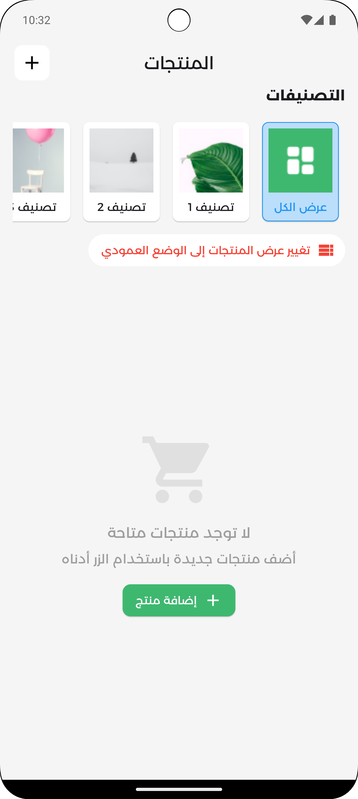
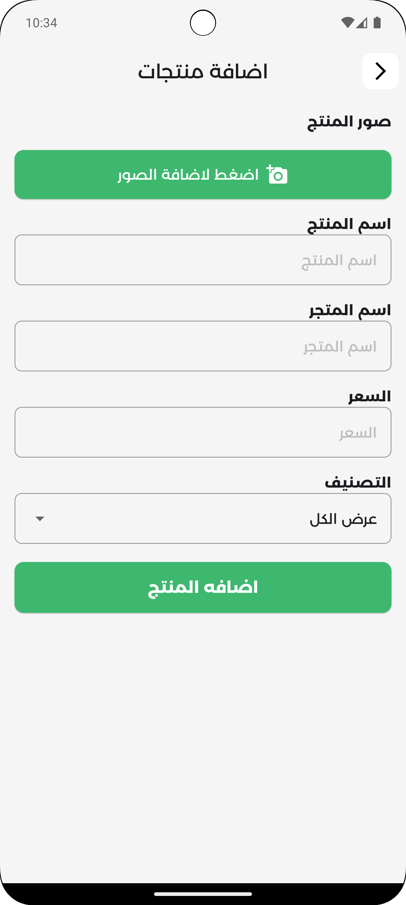
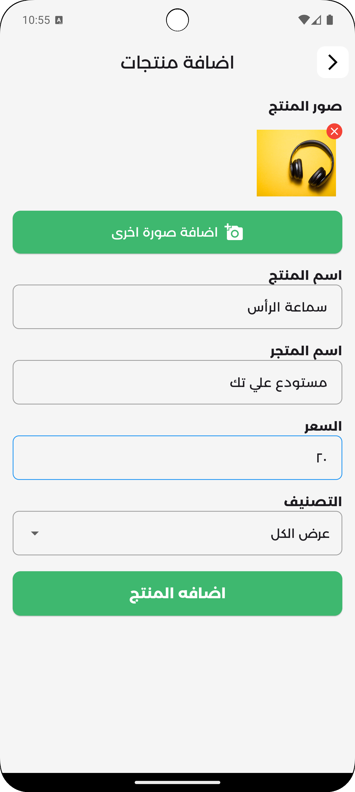

# Flutter Product Catalog

Flutter Product Catalog is a mobile application built with Flutter for managing and showcasing a catalog of products. It allows users to view products in both list and grid views, add new products, and delete existing ones. The app utilizes Riverpod for state management and features a clean and responsive user interface.

## Features

- Display products in list and grid views
- Add new products with images, names, prices, and store information
- Delete products with swipe-to-delete functionality
- Responsive design for various screen sizes

## Technologies Used

- Flutter
- FVM
- Riverpod
- Dart

## Getting Started

1. Clone the repository.
2. Install FVM (Flutter Version Management) for managing Flutter versions.
3. Install Flutter version 3.22.0 using FVM: `fvm install 3.22.0`.
4. Use Flutter version 3.22.0 for this project: `fvm use 3.22.0`.
5. Clean any existing build artifacts: `fvm flutter clean`.
6. Install project dependencies: `fvm flutter pub get`.
7. Run the app using `fvm flutter run`.

## Screenshots

